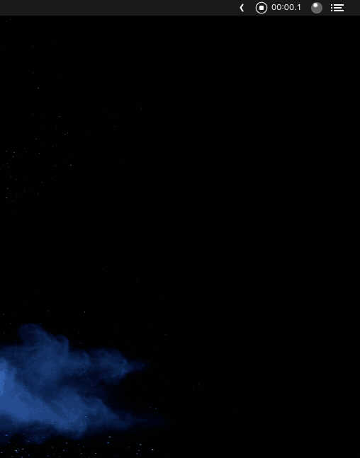

<p align="center">
	
</p>
<p align="center">
	<a href="https://webuild.community">
        
	</a>
	<a href="https://github.com/dwarvesf/auto-dnd/releases/latest">
 		
	<a href="https://img.shields.io/badge/platform-macOS-lightgrey.svg">
 		
	</a>
	<a href="https://img.shields.io/badge/requirements-macOS Sierra+-ff69b4.svg">
 		
	</a>
</p>

## Sudo.fm

Don't know what to listen whenever you need to focus, or need some music for chilling? 

The other music is too boring or you just need some ambience sounds?

Sudo.fm is what you need

Sudo.fm will give you the music that suits your mood.

Currently, Sudo.fm supports 
- 3 moods: Code, Chill, and Sleep
- 3 ambience sounds: Coffee shop, Rain, Sea wave


<p align="center">
	
</p>

## 🚀 Install

Sudo.fm is notarized before distributed. It's safe to use 👍

#### Using HomeBrew

```Shell
$ brew tap dwarvesf/homebrew-tap
$ brew cask install sudofm
```

#### Manual download

- [Download latest version](https://github.com/dwarvesf/sudo-fm-macos/releases/latest)
- Unzip and drag the app to the Applications folder
- Right click and press open in context menu to open app

## 🕹 Usage

- Open the app
- Select ambience to play (scroll to adjust the volume)
- User can scroll the menu button to quickly adjust music volume

## ✨<a href="https://github.com/dwarvesf/auto-dnd/graphs/contributors">Contributors</a>

This project exists thanks to all the people who contribute. Thank you guys so much 👏

[](https://sourcerer.io/fame/phucledien/dwarvesf/sudo-fm-macos/links/0)[](https://sourcerer.io/fame/phucledien/dwarvesf/sudo-fm-macos/links/1)[](https://sourcerer.io/fame/phucledien/dwarvesf/sudo-fm-macos/links/2)[](https://sourcerer.io/fame/phucledien/dwarvesf/sudo-fm-macos/links/3)[](https://sourcerer.io/fame/phucledien/dwarvesf/sudo-fm-macos/links/4)[](https://sourcerer.io/fame/phucledien/dwarvesf/sudo-fm-macos/links/5)[](https://sourcerer.io/fame/phucledien/dwarvesf/sudo-fm-macos/links/6)[](https://sourcerer.io/fame/phucledien/dwarvesf/sudo-fm-macos/links/7)

Please read [this](CONTRIBUTING.md) before you make a contribution.

## Requirements

macOS version >= 10.12.2

## You may also like

- [Hidden Bar](https://github.com/dwarvesf/hidden) - An ultra-light MacOS utility that helps hide menu bar icons
- [Blurred](https://github.com/dwarvesf/blurred) - A macOS utility that helps reduce distraction by dimming your inactive noise
- [Micro Sniff](https://github.com/dwarvesf/micro-sniff) - An ultra-light macOS utility that notify whenever your micro-device is being used
- [VimMotion](https://github.com/dwarvesf/VimMotionApp) - Access macOS UI elements with your fingers stay on keyboard. Inspired by vim-easymotion & avy-mode.

## License

MIT &copy; [Dwarves Foundation](https://github.com/dwarvesf)
